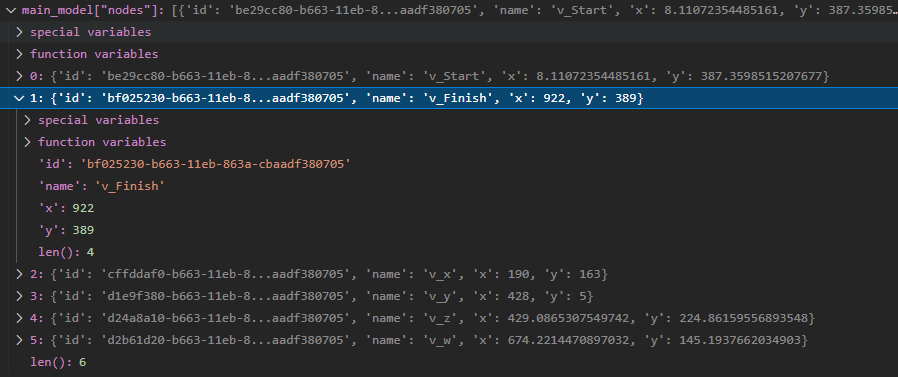
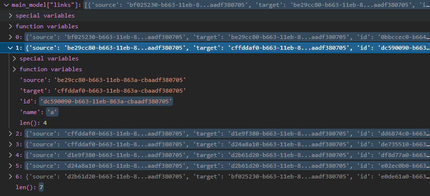

# Generated Model Structure

This model structure is generated from graphwalker JSON file. The end result can be passed to `json_graph.node_link_graph` to create a Networkx graph representation so we can use Networkx graph operations. In our case, creating communities will be executed on the outcome of the `json_graph.node_link_graph` method.

When a graphwalker JSON file passed to the `generate_graph_from_graphwalker_json` function in the `graph_conversation.py` file, the following object will be the result;

``` python
    model = {
        "directed": False,
        "multigraph": False,
        "graph": {"name": model_data["name"]},
        "nodes": [],
        "links": [],
    }
```

An example of nodes property looks like this:



An example of links property looks like this:


